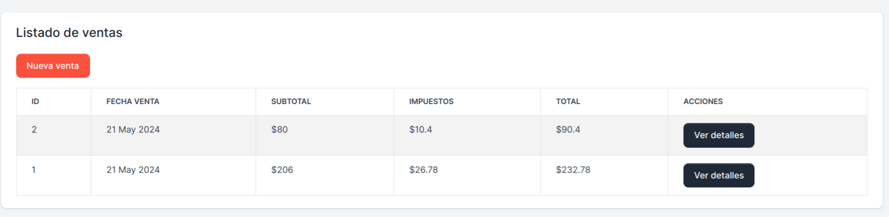
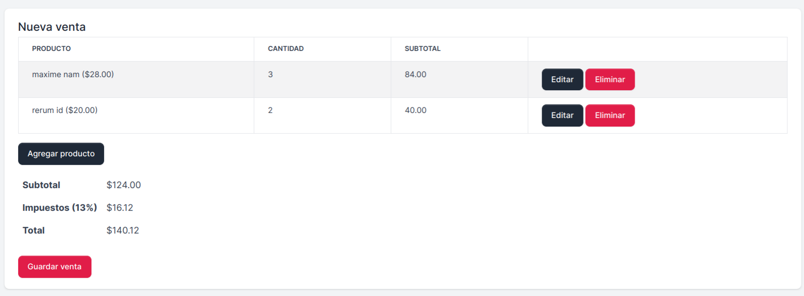
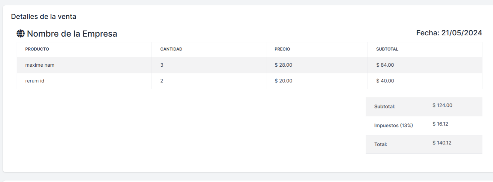

# Demo ventas

## Como clonarlo y usar el proyecto

- Clonar el repositorio usando **git clone <https://github.com/CodingWithLuis/laravel-orders.git>**
- Copiar el archivo **.env.example** en un nuevo archivo llamado **.env** (es necesario crear un nuevo archivo .env)  
- Ejecutar el comando **php artisan key:generate**
- Ejecutar el comando **composer install**
- Ejecutar el comando **php artisan migrate:fresh --seed**
- Ejecutar el comando **php artisan serve**
- Deben abrir la URL y crear un nuevo usuario

## Requisitos para usarlo

- Tener instalado **PHP** en la versión 8.2 como mínimo, lo pueden descargar del siguiente enlace **<https://youtu.be/MPRLUd8Pmyo?si=uQuoQFGur60oBzQF>**
- Tener instalado **composer**, lo pueden descargar del siguiente enlace **<https://getcomposer.org/>**

## Funcionamiento

- Listado de ventas

- Generar una venta

- Detalles de la venta

